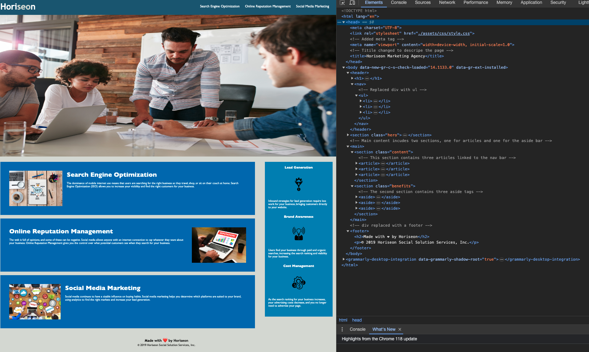
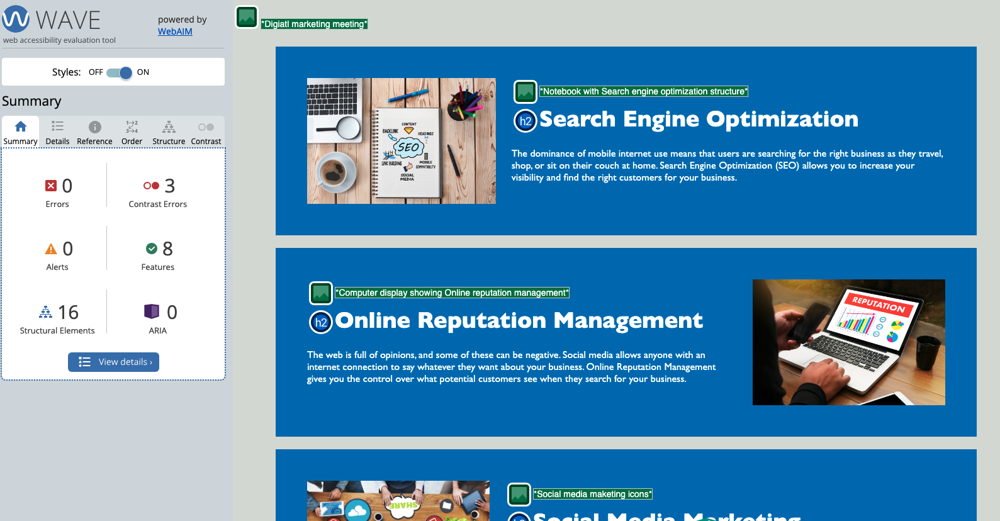

# Pordfolio Page HTML CSS Git 

## Overview 

My task was to optimise a webpage which must meet accessibility standards. 

* Semantic HTML elements can be found throughout the source code
* HTML elements follow a logical structure independent of styling and positioning
* Image and icon elements contain accessible `alt` attributes
* Heading attributes fall in sequential order
* Title elements contain a concise, descriptive title

This challenge involves a very important aspect of web development: **accessibility**. 

## The Technologies used

- **HTML5**
- **CSS3**
- **Git and GitHub**
- **Web Accessability Evaluation Tool**

Link to  <a href="https://d-tsonev.github.io/Portfolio-Page/">GitHub Page</a>

Link to  <a href="https://github.com/D-Tsonev/Portfolio-Page">Repository</a>

## The Approach

I replaced all non-semantic HTML elements with semantic HTML tags that define the meaning of the content.

Replaced div tags with header, footer, ul, aside, and section tags for more clarity.

Allo added a main content which includes two sections, one for articles and one for the aside bar.

I added **alt** attribute that specifies an alternate text for an image that was missing.

After following **Scout Rule** cleaning the CSS file and removing the repeated classes, I tested the page for errors using the Web Accessibility evaluation tool.

